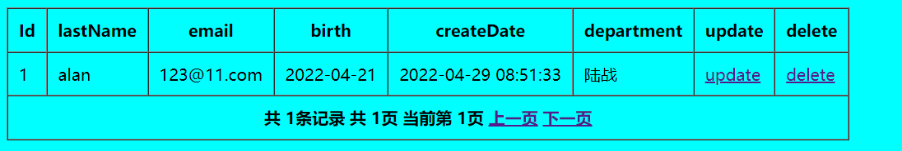
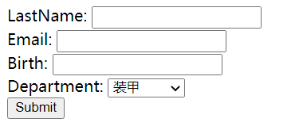
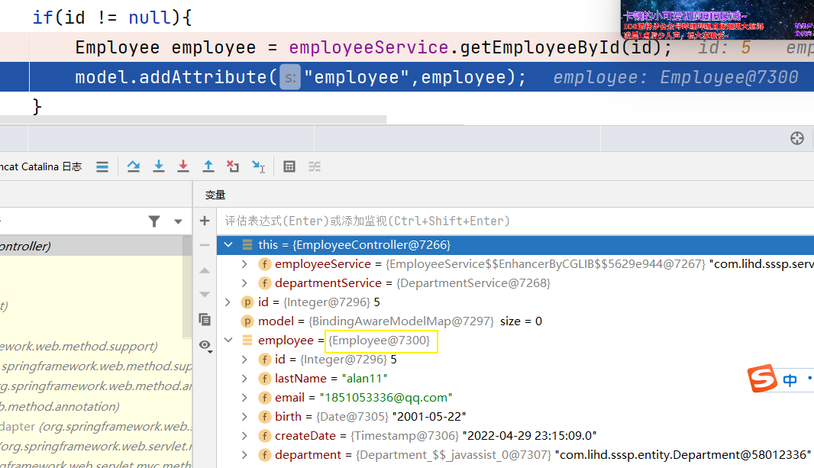
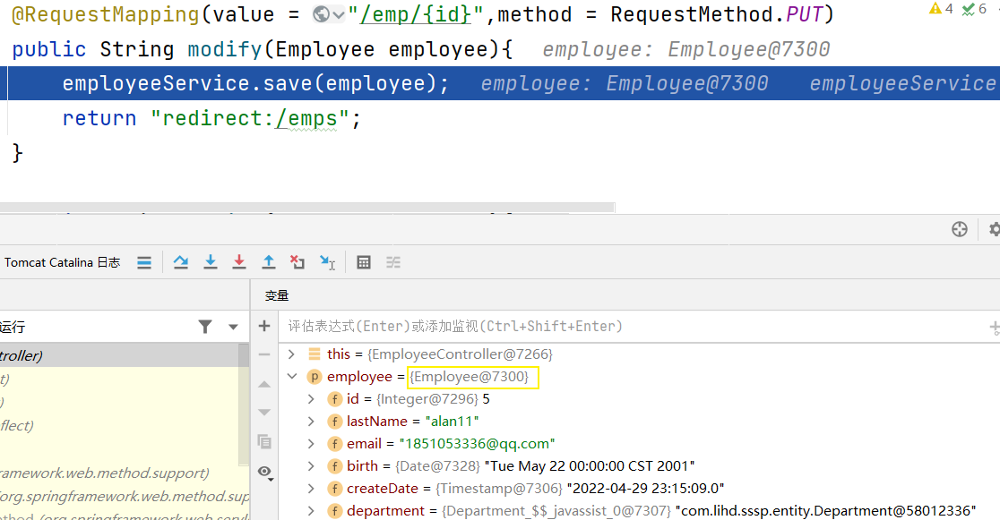
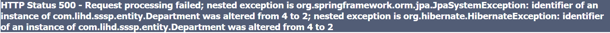

###0 感受
这个jsp是真的挺难学的 这让我想到了大二上jsp的无限有问题了
罢了罢了 就是体验一天jsp看不懂也就算了 
觉得 jsp看不懂就直接复制 不要因小失大 我们的时间不多了 今天必须解决 2022年4月29日15:45:34
还是thymeleaf + vue 感觉更阳间一点 
这个jsp + jQuery 是真的难顶

### 学习到的新知识
1 如何使用lib的方式 整合sssp
2 jquery发送ajax (注意和@ResponseBody注解配合使用)
3 @ModelAttribute
4 @DateTimeFormat()
5 jsp form 的 modelAttribute="emp"
6 二级缓存 

### 1 简介
SSSP SpringMVC + Spring + SpringData + JPA
实现很简单的 分页 只有两张表 可以视为单表
主要是数据库部分几乎不用写任何代码 并且包名从 dao -> repository
### 2 搭建环境 基于jar
#### 新建空项目

#### 添加jar包

#### 添加web支持

#### 配置tomcat

#### web.xml 
位于WEB-INF下
配置Spring容器和SpringMVC容器的位置
WEB三大组件
```xml
<?xml version="1.0" encoding="UTF-8"?>
<web-app xmlns="http://xmlns.jcp.org/xml/ns/javaee"
         xmlns:xsi="http://www.w3.org/2001/XMLSchema-instance"
         xsi:schemaLocation="http://xmlns.jcp.org/xml/ns/javaee http://xmlns.jcp.org/xml/ns/javaee/web-app_4_0.xsd"
         version="4.0">

    <!-- 配置启动 IOC 容器的 Listener -->
    <context-param>
        <param-name>contextConfigLocation</param-name>
        <param-value>classpath:applicationContext.xml</param-value>
    </context-param>

    <listener>
        <listener-class>org.springframework.web.context.ContextLoaderListener</listener-class>
    </listener>

    <!-- 配置字符编码过滤器 -->
    <!-- 字符编码过滤器必须配置在所有过滤器的最前面! -->
    <filter>
        <filter-name>CharacterEncodingFilter</filter-name>
        <filter-class>org.springframework.web.filter.CharacterEncodingFilter</filter-class>
        <init-param>
            <param-name>encoding</param-name>
            <param-value>UTF-8</param-value>
        </init-param>
    </filter>

    <filter-mapping>
        <filter-name>CharacterEncodingFilter</filter-name>
        <url-pattern>/*</url-pattern>
    </filter-mapping>

    <!-- 配置可以把 POST 请求转为 PUT、DELETE 请求的 Filter -->
    <filter>
        <filter-name>HiddenHttpMethodFilter</filter-name>
        <filter-class>org.springframework.web.filter.HiddenHttpMethodFilter</filter-class>
    </filter>

    <filter-mapping>
        <filter-name>HiddenHttpMethodFilter</filter-name>
        <url-pattern>/*</url-pattern>
    </filter-mapping>

    <!-- 配置 OpenEntityManagerInViewFilter. 可以解决懒加载异常的问题 -->
    <filter>
        <filter-name>OpenEntityManagerInViewFilter</filter-name>
        <filter-class>org.springframework.orm.jpa.support.OpenEntityManagerInViewFilter</filter-class>
    </filter>

    <filter-mapping>
        <filter-name>OpenEntityManagerInViewFilter</filter-name>
        <url-pattern>/*</url-pattern>
    </filter-mapping>

    <!-- 配置 SpringMVC 的 DispatcherServlet -->
    <servlet>
        <servlet-name>springDispatcherServlet</servlet-name>
        <servlet-class>org.springframework.web.servlet.DispatcherServlet</servlet-class>
        <load-on-startup>1</load-on-startup>
    </servlet>

    <servlet-mapping>
        <servlet-name>springDispatcherServlet</servlet-name>
        <url-pattern>/</url-pattern>
    </servlet-mapping>

</web-app>
```

#### 配置db.properties
位于src下
jdbc.user=root
jdbc.password=abc123
jdbc.driverClass=com.mysql.jdbc.Driver
jdbc.jdbcUrl=jdbc:mysql://localhost:13306/sssp
#### 配置applicationContext.xml
位于src下
Spring主容器 不负责扫描控制层 
```xml
<?xml version="1.0" encoding="UTF-8"?>
<beans xmlns="http://www.springframework.org/schema/beans"
       xmlns:xsi="http://www.w3.org/2001/XMLSchema-instance" xmlns:jpa="http://www.springframework.org/schema/data/jpa"
       xmlns:tx="http://www.springframework.org/schema/tx" xmlns:context="http://www.springframework.org/schema/context"
       xsi:schemaLocation="http://www.springframework.org/schema/beans http://www.springframework.org/schema/beans/spring-beans.xsd http://www.springframework.org/schema/data/jpa http://www.springframework.org/schema/data/jpa/spring-jpa.xsd http://www.springframework.org/schema/tx http://www.springframework.org/schema/tx/spring-tx.xsd http://www.springframework.org/schema/context http://www.springframework.org/schema/context/spring-context.xsd">
    <!-- 配置自动扫描的包 -->
    <context:component-scan base-package="com.lihd.sssp">
        <context:exclude-filter type="annotation" expression="org.springframework.stereotype.Controller"/>
        <context:exclude-filter type="annotation" expression="org.springframework.web.bind.annotation.ControllerAdvice"/>
    </context:component-scan>

    <!-- 配置数据源 -->
    <context:property-placeholder location="classpath:db.properties"/>

    <bean id="dataSource"
          class="com.mchange.v2.c3p0.ComboPooledDataSource">
        <property name="user" value="${jdbc.user}"></property>
        <property name="password" value="${jdbc.password}"></property>
        <property name="driverClass" value="${jdbc.driverClass}"></property>
        <property name="jdbcUrl" value="${jdbc.jdbcUrl}"></property>

        <!-- 配置其他属性 -->
    </bean>

    <!-- 配置 JPA 的 EntityManagerFactory -->
    <bean id="entityManagerFactory"
          class="org.springframework.orm.jpa.LocalContainerEntityManagerFactoryBean">
        <property name="dataSource" ref="dataSource"></property>
        <property name="jpaVendorAdapter">
            <bean class="org.springframework.orm.jpa.vendor.HibernateJpaVendorAdapter"></bean>
        </property>
        <property name="packagesToScan" value="com.lihd.sssp"></property>
        <property name="jpaProperties">
            <props>
                <prop key="hibernate.ejb.naming_strategy">org.hibernate.cfg.ImprovedNamingStrategy</prop>
                <prop key="hibernate.hbm2ddl.auto">update</prop>
                <prop key="hibernate.show_sql">true</prop>
                <prop key="hibernate.format_sql">true</prop>
                <prop key="hibernate.dialect">org.hibernate.dialect.MySQL5InnoDBDialect</prop>

                <prop key="hibernate.cache.use_second_level_cache">true</prop>
                <prop key="hibernate.cache.region.factory_class">org.hibernate.cache.ehcache.EhCacheRegionFactory</prop>
                <prop key="hibernate.cache.use_query_cache">true</prop>
            </props>
        </property>
        <property name="sharedCacheMode" value="ENABLE_SELECTIVE"></property>
    </bean>

    <!-- 配置事务 -->
    <bean id="transactionManager"
          class="org.springframework.orm.jpa.JpaTransactionManager">
        <property name="entityManagerFactory" ref="entityManagerFactory"></property>
    </bean>

    <!-- 配置支持基于注解的事务 -->
    <tx:annotation-driven transaction-manager="transactionManager"/>

    <!-- 配置 SpringData -->
    <jpa:repositories base-package="com.lihd.sssp"
                      entity-manager-factory-ref="entityManagerFactory"></jpa:repositories>
</beans>
```

#### 配置SpringDispatcherServlet-servlet.xml
位于 WEB-INF下 
SpringMVC配置文件 只负责管理 控制层Controller
需要设置 use-default-filters="false"
```xml
<?xml version="1.0" encoding="UTF-8"?>
<beans xmlns="http://www.springframework.org/schema/beans"
	xmlns:xsi="http://www.w3.org/2001/XMLSchema-instance"
	xmlns:context="http://www.springframework.org/schema/context"
	xmlns:mvc="http://www.springframework.org/schema/mvc"
	xsi:schemaLocation="http://www.springframework.org/schema/mvc http://www.springframework.org/schema/mvc/spring-mvc-4.0.xsd
		http://www.springframework.org/schema/beans http://www.springframework.org/schema/beans/spring-beans.xsd
		http://www.springframework.org/schema/context http://www.springframework.org/schema/context/spring-context-4.0.xsd">

	<!-- 配置自动扫描的包 -->
	<context:component-scan base-package="com.lihd.sssp" use-default-filters="false">
		<context:include-filter type="annotation" expression="org.springframework.stereotype.Controller"/>
		<context:include-filter type="annotation" expression="org.springframework.web.bind.annotation.ControllerAdvice"/>
	</context:component-scan>
	
	<!-- 配置视图解析器 -->
	<bean class="org.springframework.web.servlet.view.InternalResourceViewResolver">
		<property name="prefix" value="/WEB-INF/views/"></property>
		<property name="suffix" value=".jsp"></property>
	</bean>

	<mvc:default-servlet-handler/>
	<mvc:annotation-driven></mvc:annotation-driven>

</beans>
```
### 3 实体类

#### Department
@Cacheable
@Entity
@Table(name = "t_department")
public class Department {
private Integer id;
private String departmentName;

    @Id
    @GeneratedValue
    public Integer getId() {
        return id;
    }

    public void setId(Integer id) {
        this.id = id;
    }

    public String getDepartmentName() {
        return departmentName;
    }

    public void setDepartmentName(String departmentName) {
        this.departmentName = departmentName;
    }
}

#### Employee
采用单向多对一 将Department作为参数
```java
@Entity
@Table(name = "t_employee")
public class Employee {
    private Integer id;
    private String lastName;
    private String email;
    private Date birth;
    private Date createDate;
    private Department department;
    @Id
    @GeneratedValue
    public Integer getId() {
        return id;
    }

    public void setId(Integer id) {
        this.id = id;
    }

    public String getLastName() {
        return lastName;
    }

    public void setLastName(String lastName) {
        this.lastName = lastName;
    }

    public String getEmail() {
        return email;
    }

    public void setEmail(String email) {
        this.email = email;
    }

    @Temporal(TemporalType.DATE)
    public Date getBirth() {
        return birth;
    }

    public void setBirth(Date birth) {
        this.birth = birth;
    }
    @Temporal(TemporalType.TIMESTAMP)
    public Date getCreateDate() {
        return createDate;
    }

    public void setCreateDate(Date createDate) {
        this.createDate = createDate;
    }

    @ManyToOne(fetch = FetchType.LAZY)
    @JoinColumn(name = "department_id")
    public Department getDepartment() {
        return department;
    }

    public void setDepartment(Department department) {
        this.department = department;
    }
}
```
### 4 完成分页操作

指导
```text
Dao 层：
不带查询查询条件的分页，所以可以直接调用 PagingAndSortingRepository# findAll(Pageable pageable) 返回 Page 对象。
Service 层：
没有业务逻辑
把 Controller 传入的 pageNo 和 pageSize 封装为 Pageable 对象。注意：Pageable 的 pageNo 是从 0 开始的
调用 Dao 层的方法即可。
Controller 层：
获取 pageNo，并对 pageNo 进行校验
调用 Service 方法返回 Page 对象
把 Page 对象放入到 request 中
转发页面
JSP 页面：使用 JSTL 来显示页面
```

dao
```java
public interface EmployeeRepository extends JpaRepository<Employee, Integer> {

}
```
service
```java
@Service
public class EmployeeService {
    @Autowired
    private EmployeeRepository employeeRepository;

    @Transactional(readOnly = true)
    public Page<Employee> getPage(Integer pageNum,Integer pageSize){

        PageRequest pageRequest = new PageRequest(pageNum - 1, pageSize);

        Page<Employee> all = employeeRepository.findAll(pageRequest);

        return all;

    }

    @Transactional(readOnly = true)
    public Employee getOne(Integer id){
        Employee one = employeeRepository.findOne(id);
        return one;
    }
}
```
controller
```java
@Controller
public class EmployeeController {

    @Autowired
    private EmployeeService employeeService;

    @Autowired
    private DepartmentService departmentService;

    @RequestMapping("/")
    public String index(){
        return "index";
    }
    @RequestMapping("/emps")
    public String listAll(@RequestParam(value = "pageNo",defaultValue = "1") String pageStr, Map<String ,Object> map){

        int pageNo = 1;
        try{
            pageNo = Integer.parseInt(pageStr);
            if(pageNo < 1) pageNo = 1;
        }catch (Exception e){}

        Page<Employee> page = employeeService.getPage(pageNo, 5);

        map.put("page",page);

        return "emp/empList";
    }

    @RequestMapping(value = "/add", method = RequestMethod.GET)
    public String getOne(@RequestParam(value = "id",defaultValue = "1") Integer id,Model model){

        model.addAttribute("emp",new Employee());

        List<Department> all = departmentService.getAll();
        model.addAttribute("depts",all);

        return "emp/add";

    }
}
```

jsp
WEB-INF/views/emp/empList.jsp
```jsp
<%@ page language="java" contentType="text/html; charset=UTF-8"
         pageEncoding="UTF-8"%>
<%@ taglib prefix="c" uri="http://java.sun.com/jsp/jstl/core" %>
<%@ taglib prefix="fmt" uri="http://java.sun.com/jsp/jstl/fmt" %>

<!DOCTYPE html PUBLIC "-//W3C//DTD HTML 4.01 Transitional//EN" "http://www.w3.org/TR/html4/loose.dtd">
<html>
<head>
  <meta http-equiv="Content-Type" content="text/html; charset=UTF-8">
  <title>Title</title>
</head>
<body bgcolor="aqua">


<c:if test="${page == null || page.numberOfElements == 0 }">
  没有任何记录.
</c:if>
<c:if test="${page != null && page.numberOfElements > 0 }">
  <table border="1" cellpadding="10" cellspacing="0">
    <tr>
      <th>Id</th>
      <th>lastName</th>
      <th>email</th>
      <th>birth</th>
      <th>createDate</th>
      <th>department</th>
      <th>update</th>
      <th>delete</th>
    </tr>
    <c:forEach items="${page.content}" var="emp">
      <tr>
        <td>${emp.id}</td>
        <td>${emp.lastName}</td>
        <td>${emp.email}</td>

        <td>
          <fmt:formatDate value="${emp.birth}" pattern="yyyy-MM-dd"/>
        </td>
        <td>
          <fmt:formatDate value="${emp.createDate}" pattern="yyyy-MM-dd hh:mm:ss"/>
        </td>

        <td>${emp.department.departmentName}</td>
        <td><a href="/">update</a></td>
        <td><a href="/">delete</a></td>
      </tr>
    </c:forEach>
    <tr>
      <th colspan="8">
        共 ${page.totalElements}条记录
        共 ${page.totalPages}页
        当前第 ${page.number + 1}页
        <a href="?pageNo=${page.number + 1 - 1}">上一页</a>
        <a href="?pageNo=${page.number + 1 + 1}">下一页</a>
      </th>
    </tr>
  </table>
</c:if>

</body>
</html>
```
运行效果 主要还得写数据 太难了



### 5 显示表单页面 使用二级缓存
```text
确定开发目标：
Dao 层：
查询所有的 Department
且需要使用 JPA 的二级缓存 ？
Service 层：调用 Dao 层的方法，获取所有的 Department，返回即可
Controller 层：
调用 Service 层，获取所有的 Department，并放入到 request 中
创建一个新的 Employee 对象，放入到 request 中。且其键和表单的 modelAttribute 属性值一致。
转发页面
JSP 页面：
需要使用 SpringMVC 的表单标签来显示表单页面
注意：form:form 标签必须设置一个 modelAttribute 属性，以从 request 中获取对应的 bean，要求该 bean 的属性和表单字段是一一对应的。
```

在src下放入ehcache.xml

在Department上加上 @Cacheable注解

在DepartmentRepository添加 
```java
public interface DepartmentRepository extends JpaRepository<Department,Integer> {

    @QueryHints({@QueryHint(name=org.hibernate.ejb.QueryHints.HINT_CACHEABLE,value="true")})
    @Query("from Department d")
    List<Department> getAll();
}
```
之后service中调用这个方法便可以实现二级缓存

DepartmentService 使用findAll无法实现二级缓存
```java
@Service
public class DepartmentService {

    @Autowired
    private DepartmentRepository departmentRepository;

    public List<Department> getAll(){
//        return departmentRepository.findAll();
        return departmentRepository.getAll();
    }
}
```
```text
@RequestMapping(value = "/add", method = RequestMethod.GET)
    public String getOne(@RequestParam(value = "id",defaultValue = "1") Integer id,Model model){

        model.addAttribute("emp",new Employee());

        List<Department> all = departmentService.getAll();
        model.addAttribute("depts",all);

        return "emp/add";
    }
```
jsp 
WEB-INF/views/emp/add.jsp
```jsp
<%@ page language="java" contentType="text/html; charset=UTF-8"
         pageEncoding="UTF-8"%>
<%@ taglib prefix="form" uri="http://www.springframework.org/tags/form" %>
<%@ taglib prefix="c" uri="http://java.sun.com/jsp/jstl/core" %>

<!DOCTYPE html PUBLIC "-//W3C//DTD HTML 4.01 Transitional//EN" "http://www.w3.org/TR/html4/loose.dtd">
<html>
<head>
  <meta http-equiv="Content-Type" content="text/html; charset=UTF-8">
  <title>Insert title here</title>
  <script type="text/javascript" src="${pageContext.request.contextPath }/scripts/jquery-1.9.1.min.js"></script>
  <script type="text/javascript">
    $(function(){
      $("#lastName").change(function(){
        var val = $(this).val();
        val = $.trim(val);
        $(this).val(val);

        //若修改的 lastName 和之前的 lastName 一致, 则不发送 Ajax 请求, 直接 alert:lastName 可用!
        var _oldLastName = $("#_oldLastName").val();
        _oldLastName = $.trim(_oldLastName);
        if(_oldLastName != null && _oldLastName != "" && _oldLastName == val){
          alert("lastName 可用!");
          return;
        }

        var url = "${pageContext.request.contextPath }/ajaxValidateLastName";
        var args = {"lastName":val,"date":new Date()};

        $.post(url, args, function(data){
          if(data == "0"){
            alert("lastName 可用!");
          }else if(data == "1"){
            alert("lastName 不可用!");
          }else{
            alert("网络或程序出错. ");
          }
        });
      });
    })
  </script>
</head>
<body>

<c:set value="${pageContext.request.contextPath }/emp" var="url"></c:set>
<c:if test="${employee.id != null }">
  <c:set value="${pageContext.request.contextPath }/emp/${employee.id}" var="url"></c:set>
</c:if>

<form:form action="${url}" method="POST" modelAttribute="emp">

  <c:if test="${employee.id != null }">
    <input type="hidden" id="_oldLastName" value="${employee.lastName }"/>
    <form:hidden path="id"/>
    <input type="hidden" name="_method" value="PUT"/>
  </c:if>

  LastName: <form:input path="lastName" id="lastName"/>
  <br>
  Email: <form:input path="email"/>
  <br>
  Birth: <form:input path="birth"/>
  <br>
  Department:
  <form:select path="department.id" items="${depts }"
               itemLabel="departmentName" itemValue="id"></form:select>
  <br>
  <input type="submit" value="Submit"/>

</form:form>

</body>
</html>
```

运行结果

由于使用了二级缓存 因此刷新多少次也只有一条 语句
可以把 Department类上面的@Cacheable去掉 便是刷新一次查询一次 这就是二级缓存的作用


##### 二级缓存test测试
测试代码 主要看下面的就行了
```java
public class StartTest {
    private ClassPathXmlApplicationContext context;
    private EntityManagerFactory entityManagerFactory;
    {
        context = new ClassPathXmlApplicationContext("applicationContext.xml");
        entityManagerFactory = context.getBean(EntityManagerFactory.class);

    }

    @Test
    public void getDataSource(){
        DataSource bean = context.getBean(DataSource.class);
        System.out.println(bean);
    }

    @Test
    public void testSecondCache(){

        String jpql = "from Department d";

        EntityManager entityManager = entityManagerFactory.createEntityManager();
        Query query = entityManager.createQuery(jpql);
        for (Object o : query.setHint(QueryHints.CACHEABLE, true).getResultList()) {
            System.out.println(o);
        }
        entityManager.close();

        entityManager = entityManagerFactory.createEntityManager();
        query = entityManager.createQuery(jpql);
        for (Object o : query.setHint(QueryHints.CACHEABLE, true).getResultList()) {
            System.out.println(o);
        }
        entityManager.close();
    }
}
```
测试结果 也证明二级缓存生效
```text
Hibernate: 
    select
        department0_.id as id1_0_,
        department0_.department_name as departme2_0_ 
    from
        t_department department0_
com.lihd.sssp.entity.Department@6b7d1df8
com.lihd.sssp.entity.Department@5d05ef57
com.lihd.sssp.entity.Department@213deac2
com.lihd.sssp.entity.Department@23eee4b8
com.lihd.sssp.entity.Department@28952dea
com.lihd.sssp.entity.Department@c68a5f8
com.lihd.sssp.entity.Department@69c6161d
com.lihd.sssp.entity.Department@3aefae67
com.lihd.sssp.entity.Department@2e1792e7
com.lihd.sssp.entity.Department@6719a5b8
```

### 6 Ajax验证
```text
确定开发目标：
Dao 层：新建一个方法：根据 lastName 查询对应的 Employee，若存在返回 Employee 对象，若不存在则返回 null
Service 层：直接调用 Dao 方法返回结果即可。
Controller 层：
获取请求参数
调用 Service 层验证 lastName 对应的 Employee 是否存在
若存在则返回 “1”，若不存在则返回 “0”。 需要使用 @ResponseBody 注解
JSP 页面：使用 jQuery 完成 Ajax 的发送，和结果的响应。

```

这好像是 jQuery实现的
dao需要声明一个方法
```java
public interface EmployeeRepository extends JpaRepository<Employee, Integer> {
    Employee getEmployeeByLastName(String lastName);
}
```
service
```text
@Transactional(readOnly = true)
    public Employee getByLastName(String lastName){
        return employeeRepository.getEmployeeByLastName(lastName);
    }
```

controller
记住这个@ResponseBody注解 否则会被当做页面解析
```text
@ResponseBody
    @RequestMapping(value = "/ajaxValidateLastName",method = RequestMethod.POST)
    public String ajaxValidateLastName(String lastName){
        Employee employee = employeeService.getByLastName(lastName);
        if (employee != null) {
            return "1";
        }else{
            return "0";
        }
    }

```


下面的代码实现 了 异步请求 ajax
```jsp
<script type="text/javascript" src="${pageContext.request.contextPath }/scripts/jquery-1.9.1.min.js"></script>
  <script type="text/javascript">
    $(function(){
      $("#lastName").change(function(){
        var val = $(this).val();
        val = $.trim(val);
        $(this).val(val);

        //若修改的 lastName 和之前的 lastName 一致, 则不发送 Ajax 请求, 直接 alert:lastName 可用!
        var _oldLastName = $("#_oldLastName").val();
        _oldLastName = $.trim(_oldLastName);
        if(_oldLastName != null && _oldLastName != "" && _oldLastName == val){
          alert("lastName 可用!");
          return;
        }

        var url = "${pageContext.request.contextPath }/ajaxValidateLastName";
        var args = {"lastName":val,"date":new Date()};

        $.post(url, args, function(data){
          if(data == "0"){
            alert("lastName 可用!");
          }else if(data == "1"){
            alert("lastName 不可用!");
          }else{
            alert("网络或程序出错. ");
          }
        });
      });
    })
  </script>
```

### 7 完成添加
```text
确定开发目标：
Dao 层：不需要定义任何方法，直接使用 JpaRepository 或其父接口提供的 save 方法即可
Service 层：需要调用 Dao 层的方法。注意：需要设置 createTime 属性
Controller 层：调用 Service 层的方法，重定向到显示所有员工的页面
注意：如何把页面上输入的字符串转为 Date 类型。使用@DateTimeFormat 注解!

```


service 如果是添加 则需要设置 创建时间 如果是修改就不要设置
这里使用的是一个请求 
```java
@Transactional
    public void save(Employee employee){
        if(employee.getId() == null){
            employee.setCreateDate(new Date());
        }
        employeeRepository.save(employee);
    }
```
controller -  post
```java
//提交 post
    @RequestMapping(value = "/emp",method = RequestMethod.POST)
    public String save(Employee employee){
        //那个post方法怎么找到我的 ？
        employeeService.save(employee);
        return "redirect:/emps";
    }
```
这个modelAttribute="emp" 必须和 方法中的 保持一致
```html
<form:form action="${url}" method="POST" modelAttribute="emp">


  LastName: <form:input path="lastName" id="lastName"/>
  <br>
  Email: <form:input path="email"/>
  <br>
  Birth: <form:input path="birth"/>
  <br>
  Department:
  <form:select path="department.id" items="${depts }"
               itemLabel="departmentName" itemValue="id"></form:select>
  <br>
  <input type="submit" value="Submit"/>

</form:form>
```
### 8 表单回显
```text
确定开发目标：
SpringMVC 表单回显的原理：
实际上表单的回显是由 SpringMVC 的 form 标签完成的
在 Handler 方法中，向 request  中添加一个属性。键：SpringMVC form:form 标签 modelAttribute 属性值，值：包含了回显信息的一个 bean 对象
URL：/emp/{id}，method：GET
Dao 层：直接调用方法，根据 id 来获取对应的 bean
Service 层：调用 Dao 层的方法，返回 bean 对象
Controller 层：
获取 id
调用 Service 方法，得到 bean 的对象
获取全部的 Department，并放入到 request 中。
把 bean 对象放入到 request 中，键为：form:form 标签的 modelAttribute 属性值
转发页面

```
service
```java
@Transactional
    public Employee getEmployeeById(Integer id){
        return employeeRepository.findOne(id);
    }

```
controller 
```java
//查询一个 回显 get
    @RequestMapping(value = "/emp/{id}",method = RequestMethod.GET)
    public String circumference(@PathVariable("id") Integer id,Model model){
        Employee one = employeeService.getOne(id);
        model.addAttribute("emp",one);
        model.addAttribute("depts",departmentService.getAll());
        return "emp/add";
    }
```

注意 modelAttribute="emp" 
我是真™不想写 ,这jsp好烦 全忘了  毕竟是大二上学的 都快两年了
```html
<form:form action="${url}" method="POST" modelAttribute="emp">

  <c:if test="${emp.id != null }">
    <input type="hidden" id="_oldLastName" value="${emp.lastName}"/>
    <form:hidden path="id"/>
    <form:hidden path="createDate"/>
    <input type="hidden" name="_method" value="PUT"/>
  </c:if>

  LastName: <form:input path="lastName" id="lastName"/>
  <br>
  Email: <form:input path="email"/>
  <br>
  Birth: <form:input path="birth"/>
  <br>
  Department:
  <form:select path="department.id" items="${depts }"
               itemLabel="departmentName" itemValue="id"></form:select>
  <br>
  <input type="submit" value="Submit"/>

</form:form>
```


### 9 修改状态下的ajax验证
```text
确定开发目标：
和 添加状态下 Ajax 验证的区别：若修改后当前的 lastName，则不应该再发送任何 Ajax 请求，而直接 alert：用户名可用。
JSP 页面：修改 JS 的 Ajax 请求逻辑：若修改回之前的 lastName 则不发送任何请求，直接弹出 “用户名可用”

```

```text
<script type="text/javascript" src="${pageContext.request.contextPath }/scripts/jquery-1.9.1.min.js"></script>
  <script type="text/javascript">
    $(function(){
      $("#lastName").change(function(){
        var val = $(this).val();
        val = $.trim(val);
        $(this).val(val);

        //若修改的 lastName 和之前的 lastName 一致, 则不发送 Ajax 请求, 直接 alert:lastName 可用!
        var _oldLastName = $("#_oldLastName").val();
        _oldLastName = $.trim(_oldLastName);
        if(_oldLastName != null && _oldLastName != "" && _oldLastName == val){
          alert("lastName 可用!");
          return;
        }

        var url = "${pageContext.request.contextPath }/ajaxValidateLastName";
        var args = {"lastName":val,"date":new Date()};

        $.post(url, args, function(data){
          if(data == "0"){
            alert("lastName 可用!");
          }else if(data == "1"){
            alert("lastName 不可用!");
          }else{
            alert("网络或程序出错. ");
          }
        });
      });
    })
  </script>
```

### 10 完成修改
```text
确定开发目标：
URL：emp/{id}，method：PUT
Dao 层：继续使用 saveAndFlush 方法即可
Service 层：
不需要设置 createTime 属性
判定添加和修改的标准：传入的 bean 的 id 是否为 null
Cotroller 层：
新建 @ModelAttribute 注解修饰的方法，在其中利用 id 获取对应的 bean，并把该 bean 放入到 map 中，键为：Employee 类名第一个字母小写
在 @ModelAttribute 方法中，把关联的 department 置为 null
调用 Service 的方法进行更新
重定向到：/emps
JSP 页面：id 和 _method 加入到隐藏域中
```

service 这里应该是进不去 这个if判断的 我们修改时不应该修改他的创建时间
如果是修改时间确实就应该更新
```java
@Transactional
    public void save(Employee employee){
        if(employee.getId() == null){
            employee.setCreateDate(new Date());
        }
        employeeRepository.save(employee);
    }
```

修改
```java
//修改 put
    @RequestMapping(value = "/emp/{id}",method = RequestMethod.PUT)
    public String modify(Employee employee){
        employeeService.save(employee);
        return "redirect:/emps";
    }
```

jsp
```html
<form:form action="${url}" method="POST" modelAttribute="emp">

  <c:if test="${emp.id != null }">
    <input type="hidden" id="_oldLastName" value="${emp.lastName}"/>
    <form:hidden path="id"/>
    <form:hidden path="createDate"/>
    <input type="hidden" name="_method" value="PUT"/>
  </c:if>

  LastName: <form:input path="lastName" id="lastName"/>
  <br>
  Email: <form:input path="email"/>
  <br>
  Birth: <form:input path="birth"/>
  <br>
  Department:
  <form:select path="department.id" items="${depts }"
               itemLabel="departmentName" itemValue="id"></form:select>
  <br>
  <input type="submit" value="Submit"/>

</form:form>
```

这里报了错 400 应该是参数不合格  我们在createDate上设置 这个即可
这是我自己的实现方式 老师不是这么写的
```java
 private Integer id;
    private String lastName;
    private String email;

    @DateTimeFormat(pattern = "yyyy-MM-dd")
    private Date birth;
    @DateTimeFormat(pattern = "yyyy-MM-dd hh:mm:ss")
    private Date createDate;
    private Department department;
```


### 11 解决修改id的问题
我使用的方法和老师使用的不同 因此没有出现这种问题 下面尝试改为和老师一致的代码

其实在上面也有 
```text
新建 @ModelAttribute 注解修饰的方法，在其中利用 id 获取对应的 bean，并把该 bean 放入到 map 中，键为：Employee 类名第一个字母小写
在 @ModelAttribute 方法中，把关联的 department 置为 null
```

### 12 删除

```text
确定开发目标：
URL：emp/{id}、method：DELETE
Dao 层：直接使用 SpringData 已经自带的 delete 方法即可
Service 层：直接调用 Dao 方法即可
Controller 层：
直接调用 Service 方法
重定向到 /emps 
JSP 页面：
使用 JS confirm：确定要删除 xx 的信息吗 
把超链接的 GET 请求转为 POST 请求，且携带 _method=DELETE 的请求参数

```

service
```java
@Transactional
    public void deleteEmployeeById(Integer id){
        employeeRepository.delete(id);
    }
```

controller
```java
@RequestMapping(value = "/emp/{id}",method = RequestMethod.DELETE)
    public String delete(@PathVariable("id") Integer id){
        employeeService.deleteEmployeeById(id);
        return "redirect:/emps";
    }
```


empList.jsp页面
```text
<script type="text/javascript" src="${pageContext.request.contextPath }/scripts/jquery-1.9.1.min.js"></script>
  <script type="text/javascript">
    $(function(){
      $(".delete").click(function(){
        var label = $(this).next(":hidden").val();
        var flag = confirm("确定要删除" + label + "的信息吗?");
        if(flag){
          var url = $(this).attr("href");

          $("#_form").attr("action", url);
          $("#_method").val("DELETE");
          $("#_form").submit();
        }

        return false;
      });
    })
  </script>
  
  -----
  
  <form action="" method="POST" id="_form">
  <input type="hidden" id="_method" name="_method"/>
</form>
```

这样就能实现了 

### 13 修改成老师的大致格式 
不得不说 这个老师添加和修改的页面都是同一个 这会产生挺多问题
1 首先修改方法 个人觉得之前在修改emp.department时没报错应该就是因为我之前使用的save()
可以,刚才实验了一下 不是这个问题 (2022年4月30日00:02:04)
那我再猜测就是 因为那个ModelAttribute,这玩意我是真的没学过,我连干什么都不知道
employeeRepository.saveAndFlush(employee);

2 把这一行代码给注释了  
使用debug启动 
<%--    <form:hidden path="createDate"/>--%>

3 加断点进行debug
同一次请求 先执行
```java
@ModelAttribute
    public void getEmployee(@RequestParam(value = "id",required = false) Integer id,Model model){

        if(id != null){
            Employee employee = employeeService.getEmployeeById(id);
            model.addAttribute("employee",employee);
        }

    }
```

再执行
```java
//修改 put
    @RequestMapping(value = "/emp/{id}",method = RequestMethod.PUT)
    public String modify(Employee employee){
        employeeService.save(employee);
        // employee.setDepartment(null); //解决修改employee.Department的关键
        return "redirect:/emps";
    }
```



果然见到了我心心念念的错误 这确实是 这个@ModelAttribute导致的 解决办法
设置 setDepartment(null);
(2022年4月30日00:14:46)



最终成功了 


